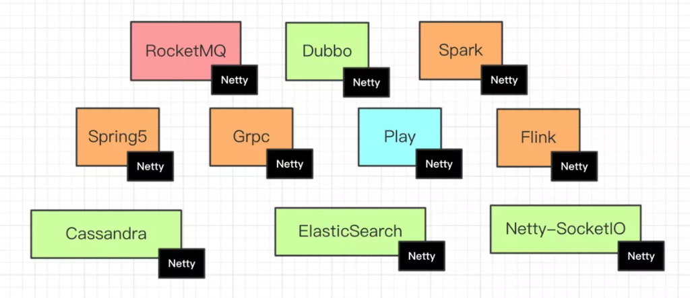

# Netty Study

## 前言:
**学习Netty主要是因为现在的工作是测试开发，会用到Netty技术去调用游戏接口。后面也会学习Protobuf相关的知识进行结合，加油!**

> **学习中...!**

**什么是Netty?能做什么?**

- [Netty](https://netty.io/)是一个致力于创建高性能网络应用程序的成熟的IO框架

- 相比较与直接使用底层的Java IO API, 你不需要先成为网络专家就可以基于Netty去构建复杂的网络、应用

- 业界常见的涉及到网络通信的相关中间件大部分基于Netty实现网络层,如下图所示:

  

本工程致力于Netty实践学习案例,是Netty初学者及核心技术巩固的最佳实践

## 1.『 基础 - 入门篇 』

- 👌 :netty-helloworld 
  《netty 之 telnet HelloWorld 详解》 

## 2. 『 基础 - 通讯协议篇 』

- 👌 :netty-http 
  《netty 之 高性能http服务器 详解》 

- 👌 netty-springboot-protobuf 
  《netty 之 netty整合springboot并使用protobuf进行传输》 

-  👌 netty-mqtt 
  1.《Netty实现高性能IOT服务器(Groza)之手撕MQTT协议篇上》 
  2.《Netty实现高性能IOT服务器(Groza)之精尽代码篇中》 

## 3. 『 中级 - 数据传输篇 』

Netty碰上关系型数据库:

-  👌 :netty-jpa-mysql 
  《netty之jpa持久化数据至MySql》 

Netty邂逅非关系数据库:

- 👌 :netty-mybatis-mongodb 
  《netty之mybaits持久化数据之mongodb》 

Netty助力流式计算:

- 👌 :netty-kafka 

  《netty 之 netty 整合 Kafka producer》 

## 4. 『 高级 - 高级应用篇 』

- 👌 :netty-IM 
  ​[Netty 入门与实战：仿写微信 IM 即时通讯系统](https://juejin.im/book/5b4bc28bf265da0f60130116)

- 👌 :netty-Rpc 
  展示给阅读此工程的开发者。

  1. [《简述RPC实现原理》](https://www.cnblogs.com/sanshengshui/p/9769517.html) 
  2. [《蚂蚁通讯框架SOFABolt之私有通讯协议设计》](https://www.cnblogs.com/sanshengshui/p/10149217.html)
  3. [《蚂蚁金服通讯框架SOFABolt解析 | 编解码机制》](https://mp.weixin.qq.com/s?__biz=MzUzMzU5Mjc1Nw==&mid=2247484406&idx=1&sn=da3e3364efc313d0014958f6f71aca17&chksm=faa0ec2ccdd7653a2ec0758c9339c0cee8c0380c7fe29f0c5d000e70bbb978cb39f3342a936f&mpshare=1&scene=1&srcid=0510q5Rte9Va9edQbJsPtd03&pass_ticket=lR9I%2BTYIxmASKZM%2F324MFsv%2FPM9jQWUssfKtnSeM%2B5YosiCJ%2B%2BEdZYUXkdDyeWqL#rd)
  4. [《蚂蚁金服通讯框架SOFABolt解析 | 序列化机制(Serializer)》](https://mp.weixin.qq.com/s?__biz=MzUzMzU5Mjc1Nw==&mid=2247484425&idx=1&sn=a7162c88139e8faf25e7c321613a58be&chksm=faa0ebd3cdd762c59a02bff3f392a213452fde17b9b4317e37cab24470740bbc1adacfc12091&mpshare=1&scene=1&srcid=0510UsIkKm8Nd8ovZBzBXPXe&pass_ticket=lR9I%2BTYIxmASKZM%2F324MFsv%2FPM9jQWUssfKtnSeM%2B5YosiCJ%2B%2BEdZYUXkdDyeWqL#rd)
  5. [《蚂蚁金服通信框架SOFABolt解析 | 协议框架解析》](https://mp.weixin.qq.com/s?__biz=MzUzMzU5Mjc1Nw==&mid=2247484442&idx=1&sn=10141f9a20199e608ce5fd7f11ee4e29&chksm=faa0ebc0cdd762d60cedbfb079444e3e6d35383f063e060947bbcb622f86db39fded94f306f4&mpshare=1&scene=1&srcid=0510gpUOmETxmQAxe1epagTl&pass_ticket=lR9I%2BTYIxmASKZM%2F324MFsv%2FPM9jQWUssfKtnSeM%2B5YosiCJ%2B%2BEdZYUXkdDyeWqL#rd)
  6. [《蚂蚁金服通信框架SOFABolt解析 | 连接管理剖析》](https://mp.weixin.qq.com/s?__biz=MzUzMzU5Mjc1Nw==&mid=2247484457&idx=1&sn=151334a84ace245a04189735743c154a&chksm=faa0ebf3cdd762e566e1736f4dd958c23f1d48bfcd33ab7064715441426d9bc9c492eadb1b61&mpshare=1&scene=1&srcid=0510QYXE7uD9M0xonldbMIqK&pass_ticket=lR9I%2BTYIxmASKZM%2F324MFsv%2FPM9jQWUssfKtnSeM%2B5YosiCJ%2B%2BEdZYUXkdDyeWqL#rd)
  7. [《蚂蚁金服通信框架SOFABolt解析|超时控制机制及心跳机制》](https://mp.weixin.qq.com/s?__biz=MzUzMzU5Mjc1Nw==&mid=2247484545&idx=1&sn=bf386f40d33215d79943eaeffa91daf6&chksm=faa0eb5bcdd7624d1d179a514767a95692dd244a44339acccdccdfd38f44c5479a0ca708e744&mpshare=1&scene=1&srcid=0510JAmEphYy3r81Kj4Bb9ue&pass_ticket=lR9I%2BTYIxmASKZM%2F324MFsv%2FPM9jQWUssfKtnSeM%2B5YosiCJ%2B%2BEdZYUXkdDyeWqL#rd)

  👌 :netty-IOT
  ​	随着技术的成熟，制造连接设备的成本正在下降。随之而来的是更广泛的物联网设备，从工业和企业应用到消费者家庭自动化（例如恒温器和智能空气过滤器）和智能汽车 - 甚至是连接内衣和牙线等眉毛般的“创新” 。连接和驱动这些设备的网络和技术（包括软件）正变得越来越强大。换句话说，就是能够实现事物互动的东西。:ear_of_rice:
  1. [《IOT市场与高性能服务器实现之路》](https://www.cnblogs.com/sanshengshui/p/9797352.html) 
  2. [《Netty实现高性能IOT服务器(Groza)之手撕MQTT协议篇上》](https://www.cnblogs.com/sanshengshui/p/9826009.html) 
  3. [《Netty实现高性能IOT服务器(Groza)之精尽代码篇下》](https://www.cnblogs.com/sanshengshui/p/9859030.html)

  拓展实践: [软件工程师树莓派获取室内温湿度的坎坷之旅](https://www.cnblogs.com/sanshengshui/p/9942963.html)

## 5. 『 高级 - Netty特性,源码篇 』

## 6. 『 号外 - 相关知识归纳篇 』
- 👌 :语言指南(proto3) 
  [《Protobuf 语言指南(proto3)》](https://www.cnblogs.com/sanshengshui/p/9739521.html) 
- 👌 :测试工具篇(Gatling) 
  - [x] [负载,性能测试工具-Gatling](https://www.cnblogs.com/sanshengshui/p/9747069.html)
  - [x] [Gatling简单测试SpringBoot工程](https://www.cnblogs.com/sanshengshui/p/9750478.html)

